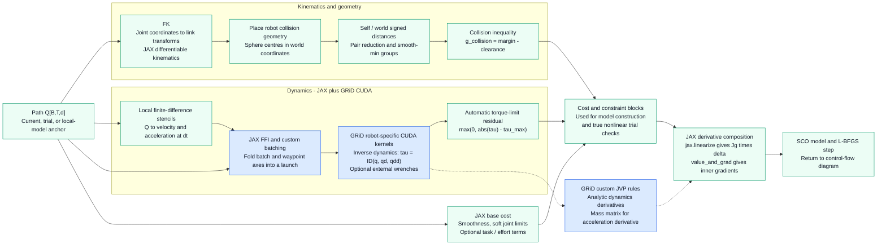

# SCO TrajOpt: Sequential Convex Optimization for Trajectory Planning

This document explains the theory behind the SCO trajectory optimizer and its JAX/CUDA implementations. The [architecture flowcharts](#13-scoal-motion-generation-architecture) describe the current shared SCO+AL path. Earlier sections retain historical details of the collision-only implementation; their penalty-only, explicit-Jacobian, and backend-parity descriptions do not all apply to the current generic solver.

**Reference:** Schulman et al., *"Finding Locally Optimal, Collision-Free Trajectories with Sequential Convex Optimization"*, RSS 2013.

---

## Table of Contents

1. [Problem Formulation](#1-problem-formulation)
2. [SCO Algorithm Overview](#2-sco-algorithm-overview)
3. [Cost Components](#3-cost-components)
4. [SDF-Based Collision Distances and Differentiable Gradients](#4-sdf-based-collision-distances-and-differentiable-gradients)
5. [Collision Linearization and Jacobians](#5-collision-linearization-and-jacobians)
6. [Inner Solver: L-BFGS](#6-inner-solver-l-bfgs)
7. [Penalty Continuation](#7-penalty-continuation)
8. [Dimensionality Reduction via Smooth-Min](#8-dimensionality-reduction-via-smooth-min)
9. [Batched Optimization and Initialization](#9-batched-optimization-and-initialization)
10. [JAX Implementation Details](#10-jax-implementation-details)
11. [CUDA Implementation and Differences from JAX](#11-cuda-implementation-and-differences-from-jax)
12. [Configuration Reference](#12-configuration-reference)
13. [SCO+AL motion-generation architecture](#13-scoal-motion-generation-architecture)

---

## 1. Problem Formulation

Given a robot with $n$ degrees of freedom, find a trajectory

$$\mathbf{q} = [q_0, q_1, \ldots, q_{T-1}] \in \mathbb{R}^{T \times n}$$

that minimizes a combination of smoothness and constraint-violation costs, subject to:

- **Fixed endpoints:** $q_0 = q_\text{start}$, $q_{T-1} = q_\text{goal}$
- **Joint limits:** $q_\text{lower} \leq q_t \leq q_\text{upper}$ for all $t$
- **Collision avoidance:** $d(q_t) \geq 0$ for all $t$, where $d$ is the signed distance to the nearest obstacle or self-collision pair

The full nonlinear objective is:

$$\min_{\mathbf{q}} \; w_\text{smooth} \cdot J_\text{smooth}(\mathbf{q}) + w_\text{coll} \cdot J_\text{coll}(\mathbf{q}) + w_\text{limits} \cdot J_\text{limits}(\mathbf{q})$$

Collision avoidance makes this non-convex. SCO handles this by repeatedly **linearizing** the collision distances and solving a convex approximation.

---

## 2. SCO Algorithm Overview

The outer loop runs for `n_outer_iters` iterations. Each outer iteration:

1. **Linearize** collision distances at the current trajectory $\mathbf{q}^k$:

$$d_\text{lin}(q_t) = d(q^k_t) + J_d(q^k_t) \cdot (q_t - q^k_t)$$

where $J_d \in \mathbb{R}^{G \times n}$ is the Jacobian of the (reduced) collision distances with respect to joint angles, computed via forward-mode AD.

2. **Solve** the convex inner subproblem with L-BFGS (`n_inner_iters` steps):

$$\min_{q} \; w_\text{smooth} \cdot J_\text{smooth}(q)
    + w_\text{coll} \cdot \sum_t \sum_g \max\!\left(0,\; m - d_\text{lin}^g(q_t)\right)^2
    + w_\text{trust} \cdot \|q - q^k\|^2
    + w_\text{limits} \cdot J_\text{limits}(q)$$

This is convex because the collision term is a squared hinge on an affine function, and all other terms are quadratic.

3. **Update** $\mathbf{q}^{k+1} \leftarrow$ solution.

4. **Scale** $w_\text{coll} \leftarrow \min(w_\text{coll} \cdot \text{penalty\_scale},\; w_\text{coll}^\text{max})$.

The trust-region term $w_\text{trust} \cdot \|q - q^k\|^2$ keeps the inner solution close to the linearization point, where the linear approximation is most accurate. It is not adapted (no shrink/expand logic); its weight is fixed.

---

## 3. Cost Components

### 3.1 Smoothness Cost

The smoothness cost penalizes acceleration and jerk using a 4th-order central-difference stencil:

$$\text{acc}_t = \frac{-q_{t} + 16 q_{t+1} - 30 q_{t+2} + 16 q_{t+3} - q_{t+4}}{12}$$

$$J_\text{smooth} = w_\text{acc} \sum_t \|\text{acc}_t\|^2 + w_\text{jerk} \sum_t \|\text{acc}_{t+1} - \text{acc}_t\|^2$$

This requires at least 5 waypoints and naturally enforces smooth, robot-friendly motion without explicitly penalizing velocity.

### 3.2 Joint-Limit Cost

Soft squared exceedance penalty:

$$J_\text{limits} = \sum_t \sum_i \left(\max(0, q_{t,i} - q^\text{upper}_i) + \max(0, q^\text{lower}_i - q_{t,i})\right)^2$$

### 3.3 Collision Cost (Linearized, Inner)

Inside the inner L-BFGS solve, the non-convex collision distances are replaced by their first-order Taylor expansion around the current outer iterate $q^k$:

$$J_\text{coll}^\text{lin} = w_\text{coll} \sum_t \sum_g \max\!\left(0,\; m - d_\text{lin}^g(q_t)\right)^2$$

where $m$ is the `collision_margin` (a safety buffer in metres, default 0.01 m) and $g$ indexes collision groups (see Section 7).

### 3.4 Final Nonlinear Cost (for ranking)

After all outer iterations, trajectories are ranked using the full nonlinear collision cost at the maximum penalty weight:

$$J_\text{eval} = w_\text{smooth} \cdot J_\text{smooth} + w_\text{limits} \cdot J_\text{limits} + w_\text{coll}^\text{max} \sum_t \sum_p \max\!\left(0,\; -d^p(q_t)\right)$$

This uses all raw collision distances (not reduced), giving an accurate ranking of the batch.

---

## 4. SDF-Based Collision Distances and Differentiable Gradients

SCO's collision penalty requires a scalar distance $d(q)$ that is:

1. **Positive** when the robot is clear of obstacles, **negative** when penetrating.
2. **Differentiable everywhere** so that $\nabla_q d$ can be computed by JAX's AD engine.
3. **Smooth near the margin** so that the gradient does not vanish until the robot is already a safe distance away.

The pipeline from joint angles to differentiable gradient has four stages.

### 4.1 Robot Geometry: Sphere / Capsule Approximations

`RobotCollisionSpherized` approximates each robot link with a set of spheres (fitted to the link's collision mesh at load time). During optimization, the robot's forward kinematics is evaluated at the current joint configuration $q$ to place all sphere centres in the world frame:

$$c_i(q) = \text{FK}_i(q) \cdot c_i^\text{local}$$

Because FK is implemented as a chain of matrix multiplications through `jaxlie.SE3`, it is fully differentiable. Every sphere centre is therefore a smooth function of $q$.

### 4.2 Primitive Signed Distance Functions

For each collision pair (self-collision or robot vs. world), a closed-form SDF is evaluated. The key ones are:

**Sphere–sphere:**
$$d(s_1, s_2) = \|c_1 - c_2\|_2 - (r_1 + r_2)$$

Positive = separation, negative = overlap depth.

**Half-space–sphere:**
$$d(h, s) = n^\top (c_s - p_h) - r_s$$

where $n$ is the half-space outward normal, $p_h$ a point on the boundary, $c_s$ the sphere centre, and $r_s$ its radius.

**Box–sphere, capsule–capsule, etc.** follow analogous closed-form constructions (see [_geometry_pairs.py](../src/pyroffi/collision/_geometry_pairs.py)).

All primitives are written entirely in `jnp` operations, so JAX can differentiate through them without any custom gradient registration.

### 4.3 The `colldist_from_sdf` Transformation

Raw SDF values are not ideal gradient sources for optimization: a penetrating pair ($d < 0$) has gradients that grow linearly, while a clear pair ($d > \text{margin}$) contributes zero gradient even though the robot may be about to enter the danger zone.

`colldist_from_sdf` (based on [Koptev et al. 2023](https://arxiv.org/pdf/2310.17274#page=7.39)) maps the raw SDF $d$ to a smoothed cost-compatible signal $\tilde{d} \leq 0$:

$$\tilde{d}(d) = \begin{cases}
d - \tfrac{1}{2} m & \text{if } d < 0 \quad \text{(penetration: linear, large negative)} \\[4pt]
-\dfrac{1}{2m} (d - m)^2 & \text{if } 0 \leq d < m \quad \text{(approach: quadratic, activates before contact)} \\[4pt]
0 & \text{if } d \geq m \quad \text{(safe: zero cost)}
\end{cases}$$

where $m$ is the `collision_margin` (default 0.01 m). The result is then clipped to $\leq 0$.

**Why this shape?**

- The quadratic branch has a non-zero gradient as soon as $d < m$, giving the optimizer advance warning before the robot actually contacts an obstacle.
- The transition at $d = 0$ is $C^1$-continuous (both branches have derivative $-1$ there), avoiding gradient discontinuities.
- The linear branch for $d < 0$ ensures large, consistent gradients during penetration, pushing the trajectory away quickly.

**Gradient flow:**

$$\frac{\partial \tilde{d}}{\partial d} = \begin{cases}
1 & d < 0 \\
-\tfrac{1}{m}(d - m) & 0 \leq d < m \\
0 & d \geq m
\end{cases}$$

By the chain rule, the gradient with respect to $q$ is:

$$\nabla_q \tilde{d} = \frac{\partial \tilde{d}}{\partial d} \cdot \nabla_q d(q)$$

where $\nabla_q d(q)$ is the Jacobian of the primitive SDF through FK, computed automatically by JAX.

### 4.4 Full Gradient Chain

Combining all stages, the gradient $\partial \tilde{d} / \partial q$ flows through:

```
q  →  FK  →  sphere centres c(q)  →  primitive SDF d(c)  →  colldist_from_sdf  →  d̃
```

Every step is a composition of differentiable `jnp` operations, so `jax.jacfwd` (used in the outer SCO loop to compute linearization Jacobians) propagates through the entire chain in one pass. No custom gradients or finite differences are needed.

---

## 5. Collision Linearization and Jacobians

At each outer iteration, the Jacobian $J_d \in \mathbb{R}^{G \times n}$ is computed at every waypoint of every trajectory in the batch.

**Forward-mode AD** is used (`jax.jacfwd`) because the output dimension $G$ (number of collision groups, typically 2–5) is much smaller than the input dimension $n$ (DOF, typically 7). Forward-mode requires $n$ JVPs, while reverse-mode would require $G$ VJPs — for $G \ll n$ the trade-off favours reverse mode, but the key bottleneck here is memory (the Jacobian buffer $[B, T, G, n]$) and compile time, not raw FLOPs. Forward-mode compiles significantly faster in practice.

The function being differentiated maps $q \mapsto d_\text{reduced}(q) \in \mathbb{R}^G$ (see Section 7). The call pattern is:

```
jax.vmap(jax.vmap(per_cfg))(trajs)   # over batch B, then timesteps T
```

where `per_cfg` computes both $d$ and $J$ at a single configuration.

---

## 6. Inner Solver: L-BFGS

The inner convex subproblem is solved with a self-contained L-BFGS implementation using the Nocedal two-loop recursion. It runs for exactly `n_inner_iters` steps (a static loop unrolled by `jax.lax.scan`) and maintains a history of `m_lbfgs` curvature pairs.

### 5.1 Two-Loop Recursion

Given gradient $g$, history buffers $(s_i, y_i, \rho_i)$, the search direction $p = -H g$ is computed as:

**Forward pass (newest → oldest):**
$$\alpha_i = \rho_i \, s_i^\top q, \quad q \leftarrow q - \alpha_i y_i$$

**Initial scaling (Shanno-Kettler):**
$$\gamma = \frac{s_\text{new}^\top y_\text{new}}{y_\text{new}^\top y_\text{new} + \epsilon}, \quad r \leftarrow \gamma \, q$$

**Backward pass (oldest → newest):**
$$\beta_i = \rho_i \, y_i^\top r, \quad r \leftarrow r + s_i (\alpha_i - \beta_i)$$

The curvature update $\rho_i = 1 / (s_i^\top y_i)$ is only accepted when $s^\top y > 10^{-10} \|y\|^2$ (positive-definite curvature condition), keeping the Hessian estimate well-conditioned.

### 5.2 Line Search

A static 5-point backtracking search is used with step sizes $[1.0, 0.5, 0.25, 0.1, 0.025]$. The best step satisfying a sufficient-decrease condition (relative 1e-4 improvement) is chosen; if none qualifies, the smallest-cost trial is used. All five cost evaluations run in parallel via `jax.vmap`.

### 5.3 Endpoint Pinning

Start and goal waypoints are held fixed throughout the inner solve by multiplying the gradient by an **endpoint mask** that zeros out the first and last DOF-block entries before each L-BFGS update and before each step is applied. This is simpler and JIT-friendly compared to constrained optimization.

### 5.4 Best-Iterate Tracking

The inner solver tracks the best iterate seen across all `n_inner_iters` steps (lowest cost), not just the final iterate. This protects against occasional oscillation near the end of the L-BFGS run.

---

## 7. Penalty Continuation

The collision weight starts at `w_collision` (default 1.0) and is multiplied by `penalty_scale` (default 3.0) after each outer iteration, capped at `w_collision_max` (default 100.0):

$$w_\text{coll}^{k+1} = \min\!\left(w_\text{coll}^k \cdot \text{penalty\_scale},\; w_\text{coll}^\text{max}\right)$$

With defaults this produces the sequence: 1 → 3 → 9 → 27 → 81 → 100 → ... over 10 outer iterations.

Early outer iterations (low $w_\text{coll}$) allow the trajectory to find a smooth, geometrically reasonable path while tolerating some collision overlap. Later iterations (high $w_\text{coll}$) push all remaining penetrations to zero. This avoids local minima that would arise from starting with a high penalty.

---

## 8. Dimensionality Reduction via Smooth-Min

A robot collision model may produce hundreds of pairwise distances (e.g. 252 sphere-sphere pairs). Computing the Jacobian of all $P$ distances — shape $[P, n]$ — is expensive in both memory and compile time.

Instead, distances are aggregated per **collision group** using a **smooth minimum**:

$$\text{smooth\_min}(d) = -\tau \cdot \log\!\sum_i \exp\!\!\left(\frac{-d_i}{\tau}\right) = -\tau \cdot \text{logsumexp}\!\left(\frac{-d}{\tau}\right)$$

where $\tau$ is `smooth_min_temperature` (default 0.05). As $\tau \to 0$ this approaches the true minimum; larger $\tau$ gives smoother gradients.

**Groups** are:
- One group for all self-collision pairs
- One group per world geometry type (e.g. boxes, spheres)

This reduces the Jacobian shape from $[P, n]$ (e.g. $[252, 7]$) to $[G, n]$ (e.g. $[3, 7]$), a **50–100× reduction** in Jacobian memory and compile time.

The smooth-min is differentiable everywhere and provides a conservative approximation: it always returns a value $\leq$ the true minimum, so the optimizer is never over-optimistic about safety margins.

---

## 9. Batched Optimization and Initialization

### 8.1 Batch Parallelism

`sco_trajopt` accepts a batch of $B$ initial trajectories (`init_trajs: [B, T, DOF]`) and optimizes all of them in parallel via `jax.vmap` over the inner L-BFGS solve. Diverse initializations improve the chance of finding a globally good (low-cost, collision-free) solution.

The best trajectory is selected by evaluating the full nonlinear cost on all $B$ final trajectories and returning the one with the lowest cost.

### 8.2 Linear Interpolation Initialization

`make_init_trajs` creates a batch of $B$ linearly-interpolated trajectories between `start` and `goal`, with independent Gaussian noise added to each:

```python
base = start * (1 - t) + goal * t        # straight-line in joint space
trajs = base + normal(key, shape) * noise_scale
```

### 8.3 Cartesian IK Initialization (bench_trajopt)

The benchmark uses a more sophisticated initialization that produces collision-aware waypoints:

1. **FK** at start and goal to get end-effector SE(3) poses.
2. **Cartesian interpolation** — position lerp + SO(3) SLERP (via log/exp on the Lie algebra).
3. **Batched MPPI IK** — solves all $T$ IK subproblems in one GPU call, warm-started from linear joint-space interpolation, with self + world collision as a soft constraint.
4. **Tiling + noise** — the single IK-solved trajectory is tiled to $[B, T, n]$ and perturbed.

---

## 10. JAX Implementation Details

### Static vs. Traced Values

`TrajOptConfig` is a frozen dataclass passed as a **static argument** to `jax.jit`. Any change to the config triggers recompilation. This allows the compiler to unroll inner loops (L-BFGS history size `m_lbfgs`, inner iterations `n_inner_iters`) and specialize the computation graph completely.

### `jax.lax.scan` for the Outer Loop

The outer SCO loop uses `jax.lax.scan` with the trajectory batch and current collision weight as carry state. This avoids Python-level iteration at JIT time and compiles the entire outer loop into a single fused computation.

### `jax.lax.scan` for the Inner L-BFGS Loop

The inner L-BFGS loop also uses `jax.lax.scan`, with the L-BFGS buffers, current iterate, and best-iterate tracker as carry. The fixed-length scan is essential for JIT compatibility.

### Endpoint Re-pinning

After each outer iteration, endpoints are re-pinned:

```python
new_trajs = new_trajs.at[:, 0, :].set(start).at[:, -1, :].set(goal)
```

This corrects any tiny floating-point drift that accumulates when the gradient mask isn't perfectly exact.

### `jax.vmap` Layout

```
outer_step:
    _compute_coll_dists_and_jacs: vmap over B, vmap over T
    _lbfgs_inner_solve:           vmap over B
        line search:              vmap over 5 alpha candidates
```

---

## 11. CUDA Implementation and Differences from JAX

The CUDA backend (`sco_trajopt_cuda`, in `_sco_trajopt_cuda_kernel.cu`) implements the same SCO algorithm but runs entirely on-device with no Python-side iteration between outer steps. Both backends share the same `TrajOptConfig` and produce trajectories that are compared against the same cost function, but several implementation choices differ.

### 11.1 Architecture

The CUDA kernel launches **one block per trajectory** (`B` blocks total). Within each block, threads cooperate over the `T` timestep dimension:

| Phase | Parallelism |
|---|---|
| FK + FD Jacobians | 1 thread per timestep (parallel) |
| Inner cost + gradient | 1 thread per timestep + block reduction |
| L-BFGS two-loop dot products | Parallel block reductions |
| Line search (5 alphas) | Parallel cost eval over T threads |

The trajectory, linearization point, and collision distances live in **shared memory** for fast intra-block access. Robot parameters (FK twists, sphere offsets, collision pairs) are loaded cooperatively into shared memory once at kernel launch.

### 11.2 Collision Jacobians: Finite Differences vs. Automatic Differentiation

This is the most significant algorithmic difference.

**JAX:** uses `jax.jacfwd` to compute exact analytical Jacobians $J_d \in \mathbb{R}^{G \times n}$ via forward-mode AD through the full FK → sphere placement → smooth-min chain. The result is exact up to floating-point precision.

**CUDA:** uses **central finite differences** with step size `fd_eps` (default $10^{-4}$ rad):

$$J_d^{(g, i)} \approx \frac{d^g(q + \epsilon e_i) - d^g(q - \epsilon e_i)}{2\epsilon}$$

This requires $2n$ FK + collision evaluations per timestep (14 for a 7-DOF arm). The Jacobians have $O(\epsilon^2)$ truncation error, but float32 cancellation limits accuracy to roughly $O(\epsilon_\text{machine} / \epsilon) \approx 10^{-3}$ relative error.

**Effect:** The less accurate Jacobians cause the SCO loop to linearize collision constraints less precisely. In practice the optimizer still converges to collision-free solutions (25/25 solved), but tends to find trajectories that are closer to obstacles (smaller clearance within the activation margin). This results in trajectories with **lower smoothness cost** (the optimizer has more freedom to be smooth since it avoids obstacles less conservatively) but **higher collision cost** at evaluation time, as more sphere-obstacle pairs fall within the activation margin.

Benchmarked on a 7-DOF Panda with bookshelf_tall (B=25, T=64, 10 outer iters, 30 inner iters):

| Metric | JAX | CUDA |
|---|---|---|
| Time | ~2.0 s | ~0.45 s (~**4.5× faster**) |
| Velocity smoothness | 0.0165 | **0.0110** |
| Best cost | **3.73** | 11.2 |
| Solved (collision-free) | 25/25 | 25/25 |

### 11.3 Smooth-Min Aggregation for Jacobians

**JAX:** `_collision_dists_reduced` calls `compute_self_collision_distance` (which returns one distance per active link pair, already taking the hard min over all sphere–sphere combinations within that pair) and `compute_world_collision_distance` (which returns one distance per link–obstacle pair, taking the hard min over the link's spheres). Smooth-min then aggregates over these per-pair distances:

$$d^g_\text{self} = \text{smooth\_min}\bigl(\min_{s_i, s_j} d(s_i, s_j) \text{ for each active link pair}\bigr)$$

**CUDA:** `sco_compute_coll_dists` applies the same two-level reduction:
1. **Hard min over spheres** — for each link pair (self) or each (link, obstacle) pair (world), find the minimum sphere-level distance.
2. **Smooth-min over pairs** — aggregate the per-pair hard-min distances into one scalar per group.

This two-level structure is essential for matching JAX's behavior. A naive single-level smooth-min over all individual sphere distances would produce biased (lower) distance estimates and diffuse Jacobian weights, degrading optimization quality.

### 11.4 Final Nonlinear Cost Evaluation

Both backends apply `colldist_from_sdf` at the **pair level** (not sphere level) when evaluating the final ranking cost:

- **Self-collision:** one distance per active link pair = hard min over all sphere–sphere combinations within the pair.
- **World collision:** one distance per (robot link, world obstacle) pair = hard min over the link's $S$ spheres.

This matches the semantics of `compute_self_collision_distance` and `compute_world_collision_distance`, which are used in JAX's `_eval_cost`.

> **Note:** applying `colldist_from_sdf` to individual sphere distances instead of per-pair distances inflates the cost by approximately $S\times$ (the number of spheres per link), because every sphere within the activation margin contributes a separate term instead of only the closest one.

### 11.5 Inner L-BFGS: Manual Implementation vs. JAX AD

**JAX:** the inner cost function is defined in Python and JAX's `value_and_grad` produces exact analytical gradients of the smoothness, linearized collision, limits, and trust-region terms. No manual gradient code is needed.

**CUDA:** all cost and gradient computations are written explicitly by hand in `sco_inner_costgrad_timestep`. Each thread computes its own timestep's contribution; gradients are accumulated across threads via `block_reduce_sum`. The smoothness gradient uses the closed-form expression derived from the 4th-order stencil (accumulated-acceleration and jerk terms over overlapping windows); the collision, trust-region, and limits gradients follow standard analytical forms.

The L-BFGS two-loop recursion is implemented cooperatively: each thread owns the elements of the $[T \times n]$ vectors corresponding to its timestep ($n = T \times \text{DOF}$), dot products are computed via block reductions, and the search direction is written back to each thread's owned slice.

### 11.6 Endpoint Pinning

Both backends zero the gradient at the first and last waypoints to pin start/goal, and re-pin the actual trajectory values after each outer iteration to prevent floating-point drift. In CUDA this is done at the thread level: threads 0 and $T-1$ zero their gradient slice, and `s_start`/`s_goal` (in shared memory) are written back to shared `s_traj` after the inner solve.

### 11.7 When to Use Each Backend

| Situation | Recommended |
|---|---|
| Highest solution quality | JAX (exact Jacobians) |
| Real-time / low-latency planning | CUDA (~4.5× faster) |
| Debugging / prototyping | JAX (readable Python, easy inspection) |
| Large batches ($B \gg 25$) | CUDA (linear scaling per block, no Python overhead) |

Both backends accept the same `TrajOptConfig` and can be selected via `use_cuda=True/False` in `sco_trajopt`.

---

## 12. Configuration Reference

| Parameter | Default | Description |
|---|---|---|
| `n_outer_iters` | 10 | Number of linearize-and-solve outer iterations |
| `n_inner_iters` | 30 | L-BFGS steps per outer iteration |
| `m_lbfgs` | 6 | L-BFGS history size (curvature pairs) |
| `w_smooth` | 1.0 | Overall smoothness weight |
| `w_acc` | 0.5 | Relative weight of acceleration in smoothness |
| `w_jerk` | 0.1 | Relative weight of jerk in smoothness |
| `w_collision` | 1.0 | Initial collision penalty weight |
| `w_collision_max` | 100.0 | Maximum collision penalty weight |
| `penalty_scale` | 3.0 | Per-outer-iteration collision weight multiplier |
| `collision_margin` | 0.01 | Safety buffer for collision activation (metres) |
| `w_trust` | 0.5 | Trust-region penalty weight |
| `w_limits` | 1.0 | Joint-limit violation penalty weight |
| `smooth_min_temperature` | 0.05 | Smooth-min temperature for per-group aggregation |

### Tuning Tips

- **Increase `n_outer_iters`** if trajectories still penetrate obstacles at convergence — the linearization needs more refinement steps.
- **Increase `w_collision` / `penalty_scale`** to push harder on collision avoidance from the start; lower these if the solver gets stuck in poor local minima.
- **Increase `n_inner_iters`** if the inner subproblem is not being solved to near-optimality (watch the cost drop per outer iteration).
- **Lower `smooth_min_temperature`** for tighter collision margins; raise it if gradients become noisy near obstacles.
- **Increase `m_lbfgs`** for better curvature approximation at the cost of higher memory and compile time.

## 13. SCO+AL motion-generation architecture

Consider a hypothetical request to move a robot from `q_start` to `q_goal` in
a fixed duration, avoiding obstacles and respecting actuator limits. Optimize
the sampled positions `Q[B,T,d]`; reconstruct velocities and accelerations
with finite differences, then obtain required torques with inverse dynamics.
Here `B` is the number of seeds, `T` the waypoint count, and `d` the joint DOF.
All waypoints are decision variables available together; the optimization
does not require a sequential forward simulation to evaluate each path.

The first diagram shows control flow; the second expands the shared physics
evaluation service used to construct local models and assess trial paths.

### Control flow: request to candidate motion

```mermaid
flowchart TD
    subgraph APP[Application setup and seeding]
        request["Point-to-point request<br/>Start, goal, scene, duration, robot limits"]
        setup["Load robot and scene<br/>Prepare FK / collision data<br/>Build or load cached GRiD CUDA library"]
        seed["Create B candidate paths<br/>Joint interpolation or Cartesian IK seeds<br/>Fix endpoints; choose dt"]
        request --> setup --> seed
    end

    subgraph OPT[Generic JAX SCO + AL solve - mapped over seeds]
        init["Initialize Q, multipliers = 0<br/>Per-term penalties and trust coefficient"]
        anchor["Freeze current path Qk<br/>Evaluate residuals and local derivatives"]
        model["SCO: linearize inequality residuals<br/>g_hat = g(Qk) + Jg(Qk) delta<br/>Keep equality residuals exact"]
        objective["Build inner AL objective<br/>Base cost + constraint terms<br/>+ quadratic trust regularization"]
        inner["L-BFGS inner iterations<br/>JAX value_and_grad and vector reductions<br/>Evaluate 5 line-search candidates"]
        trial["Form trial path<br/>Preserve fixed endpoints<br/>Evaluate true nonlinear residuals and merit"]
        accept{"Adaptive trust enabled?<br/>If enabled: sufficient actual / predicted decrease?"}
        reject["Reject: retain Qk and multipliers<br/>Adjust trust coefficient"]
        update["Accept Qtrial<br/>Dual ascent using TRUE residuals<br/>Increase penalties up to caps<br/>Adapt trust coefficient if enabled"]
        stop{"Outer iteration cap<br/>or configured residual stop?"}
        init --> anchor --> model --> objective --> inner --> trial --> accept
        accept -->|"Disabled, or test passes"| update
        accept -->|"Enabled and test fails"| reject
        update --> stop
        reject --> stop
        stop -->|"Continue"| anchor
    end

    subgraph POST[Application validation and rollout]
        validate["Validate and rank candidate paths<br/>True constraints, endpoints, objective<br/>Densify for between-waypoint checks"]
        valid{"Any acceptable candidate?"}
        motion["Select path and associated timing<br/>Optional forward simulation / controller rollout<br/>Revalidate if timing changes"]
        retry["Reseed, increase budget, revise timing<br/>or report planning failure"]
        validate --> valid
        valid -->|"Yes"| motion
        valid -->|"No"| retry
    end
    seed --> init
    stop -->|"Return candidates"| validate
    retry -.-> seed

    classDef host fill:#eef2ff,stroke:#6366f1,color:#111827;
    classDef opt fill:#ecfdf5,stroke:#059669,color:#111827;
    classDef check fill:#fff7ed,stroke:#ea580c,color:#111827;
    class request,setup,seed,validate,motion,retry host;
    class init,anchor,model,objective,inner,trial,update,reject opt;
    class accept,stop,valid check;
```



Within one outer iteration, multipliers and penalties are held fixed during
the inner solve. For `h(Q)=0`, the AL contribution is
`lambda·h + rho/2 ||h||²`. For `g(Q)<=0`, it is
`(||max(0, mu + rho*g)||² - ||mu||²)/(2*rho)`.
After accepting the trial, the shared core updates
`lambda <- lambda + dual_scale*rho*h` and
`mu <- max(0, mu + dual_scale*rho*g)` using the nonlinear residuals.

With adaptive trust enabled, the ratio compares actual nonlinear AL-merit
decrease against the local model's predicted decrease. Rejected trials keep
the path, multipliers, and penalties; each attempted step still consumes an
outer iteration. Trust adaptation is optional and defaults off.

### Acceleration and differentiation: evaluating a path



Solid arrows carry values or control; dashed arrows denote a retry or derivative
relationship. GRiD calculates torques for prescribed accelerations here. It is
not rolling the trajectory forward through time. Dynamics equality constraints
can also be supplied, but the automatic position-path term is torque feasibility.

### Mapping to the repository and limits of the diagram

| Diagram component | Implementation and scope |
|---|---|
| Seeding and orchestration | [motion_generators/_trajopt.py](../src/pyroffi/motion_generators/_trajopt.py) supplies the existing seeding pattern. The combined collision-plus-GRiD route above is a hypothetical caller composition, not an automatic behavior of that motion generator. |
| Generic solver | [optimization_engines/_dynamics_trajopt.py](../src/pyroffi/optimization_engines/_dynamics_trajopt.py): use the L-BFGS branch with constraint terms, `use_sco=True`, and optionally `adaptive_trust=True`. The caller supplies collision constraints; `robot`/`grid`/`dof` enable automatic torque terms. |
| Outer / inner loops | [optimization_engines/_trajopt_core.py](../src/pyroffi/optimization_engines/_trajopt_core.py): `_al_outer_loop`, `_lbfgs_driver`, `_adaptive_trust_step`, and `AugmentedLagrangianTerm`. |
| Collision and FK | [kinematics/_fk.py](../src/pyroffi/kinematics/_fk.py), [collision/_robot_collision.py](../src/pyroffi/collision/_robot_collision.py), and the collision residual construction in [_sco_optimization.py](../src/pyroffi/optimization_engines/_sco_optimization.py). The diagram uses the JAX FK/geometry route; dedicated CUDA alternatives are separate paths. |
| Dynamics and derivatives | [dynamics/_contact.py](../src/pyroffi/dynamics/_contact.py) constructs the torque residual; [_grid_dynamics.py](../src/pyroffi/dynamics/_grid_dynamics.py) supplies FFI/custom JVPs, and [_grid_codegen.py](../src/pyroffi/dynamics/_grid_codegen.py) generates and caches robot-specific CUDA libraries. |
| Validation and rollout | Application responsibilities in this hypothetical pipeline. An iteration cap or residual stop alone is not a feasibility certificate. |

Batching exposes independent seeds and waypoint physics evaluations to the GPU.
Finite-difference stencils couple nearby waypoints, and L-BFGS dot products
require reductions. Outer and inner optimization steps remain sequential.
Local linearization reuses an affine model during inner evaluations; it does
not imply rerunning nonlinear FK and inverse dynamics for every affine trial.
Exact nonlinear base costs or equality terms can still require those calls.

The generic solver does not pin endpoints automatically: a caller can optimize
only interior waypoints and reconstruct the endpoints in its residual/cost
functions. The dedicated collision SCO solver instead masks and re-pins them.
Likewise, the generic outer stop currently checks `max(abs(residual))`, including
inequalities; application validation should check positive inequality violation
and, when needed, stationarity and complementarity.

The inner problem is convex only when its remaining base/equality terms and
regularization preserve convexity. The automatic torque residual is pre-clipped:
linearizing it strictly inside the feasible region gives zero local sensitivity
to an approaching torque boundary. Signed torque inequalities are a possible
caller-defined alternative.

Finally, `sco_trajopt(use_cuda=True)` invokes the specialized collision CUDA
kernel, which retains penalty continuation and finite-difference collision
Jacobians. It does not implement the combined generic SCO+AL+GRiD route shown
above. JAX can accelerate that combined route using GRiD CUDA physics without
selecting the specialized CUDA SCO solver.
